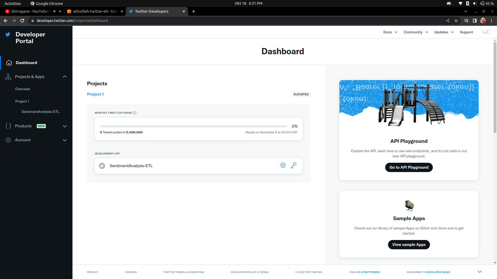
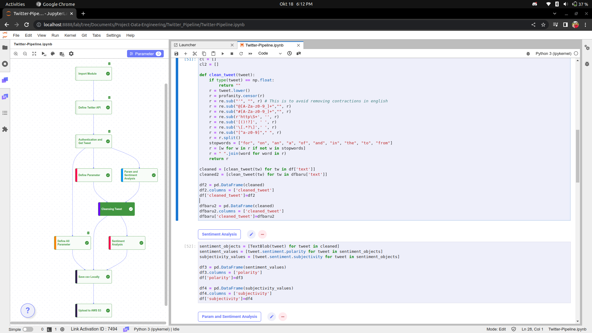

<h2 align="center">Twitter Data Pipeline</h2>

 The goal of this project is to make automation of the Twitter API so that it can be shown on the dashboard automatically everyday. 
    
The flow of this project started with make account in Twitter Developer so we get Twitter API to retrieve twitter data, then processed using python, stored on AWS S3. All these things are done periodically (batch processing) using the help of Apache-Airflow. The csv file stored on AWS S3 is then queried on AWS Redshift, then using the Redshift Connector on Google Data Studio, the result of data processing will be displayed dynamically 

### Fetch Data

 Using Twitter API, you can sign up to <code><a href="https://developer.twitter.com/en">DeveloperTwitter</a></code>, if done just make a project and you will get the API Key dan other things that important to use when retrieving data.

### Processing Data

 Here i use Jupyterlab for IDLE, its fun because in jupyterlab have an extensions named Link, there we can make flow diagram for our project. The flow in processing part is first we enter the key values obtained from the <code><a href="https://developer.twitter.com/en">DeveloperTwitter</a></code>, here we use the tweepy module. then fetching data and doing various kinds of analysis. then the flow of data storage from twitter data is after we create a list containing the desired data, then change the list to pandas dataframe then export to csv file

### Upload to AWS S3 Using Python

 Upload to AWS S3 using the help of the Boto3 module. We can upload to the S3 bucketlist when we already have an AWS account. we can make for free with certain limitations.

